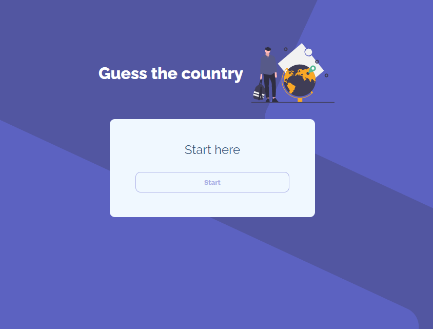
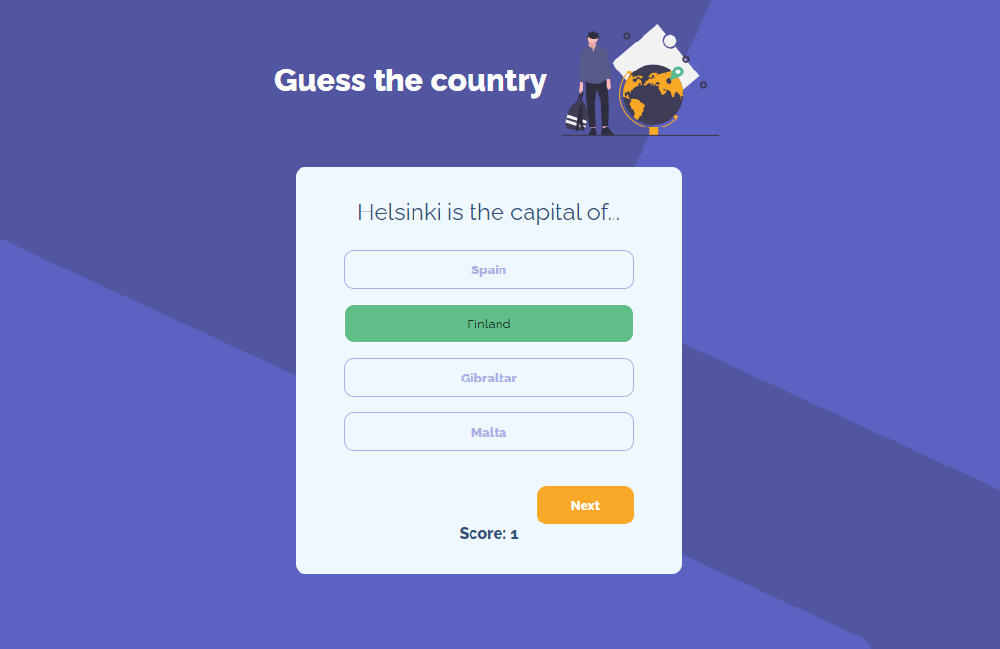

# Guess-the-Country

## Descripción 
 

 Juego de preguntas sobre las capitales de países europeos desarrollado con Vanilla JavaScript. Hace peticiones a la api https://restcountries.com/ para comprobar las respuestas correctas y hacer preguntas aleatorias. Además va guardando la puntuación de las respuestas acertadas.

- HTML 📄
- CSS🎨
- JavaScript✨

 

## Url para ver el resultado
 
Aquí pueder ver el proyecto: https://guesscountry.netlify.app/
